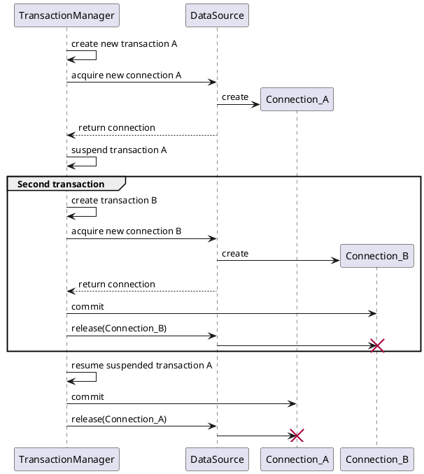
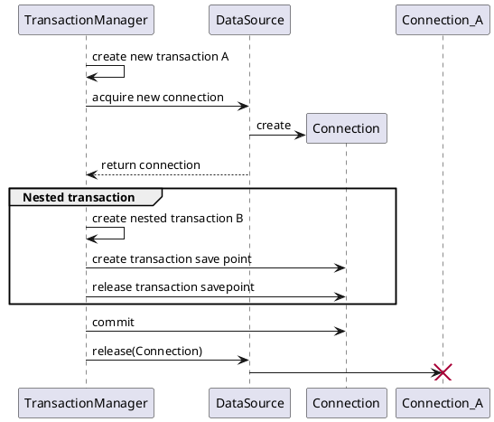

# Transactions

Spring transactions behaviour in case of an exception in nested transaction.

| Nested transaction  | Rollback on main transaction  | JdbcTransactionManager |
|---|---|---|
|REQUIRED   | Yes | Participating in existing transaction, Participating transaction failed - marking existing transaction as rollback-only
|MANDATORY   | Yes  | Participating in existing transaction, Participating transaction failed - marking existing transaction as rollback-only
|SUPPORTS   | Yes  | Participating in existing transaction, Participating transaction failed - marking existing transaction as rollback-only
|REQUIRES NEW   | No  | Rolling back nested transaction
|NESTED   | No  | Rolling back transaction to savepoint
|NOT SUPPORTED   | No  | Should roll back transaction but cannot - no transaction available
|NEVER   | No  | Existing transaction found for transaction marked with propagation 'never'

# Difference between NESTED and REQUIRES_NEW transactions

REQURIES_NEW acquires a new physical connection to create a new transaction, because it's impossible to start a new transaction on the same connection when
there is already a transaction in progress.

NESTED on the other hand uses [JDBC Savepoint](https://docs.oracle.com/javase/tutorial/jdbc/basics/transactions.html) to mark a point that we can rollback to in case of an exception.
Main transaction doesn't have to be rolled back though.
Also NESTED transaction is committed at the end of the outer transaction.

